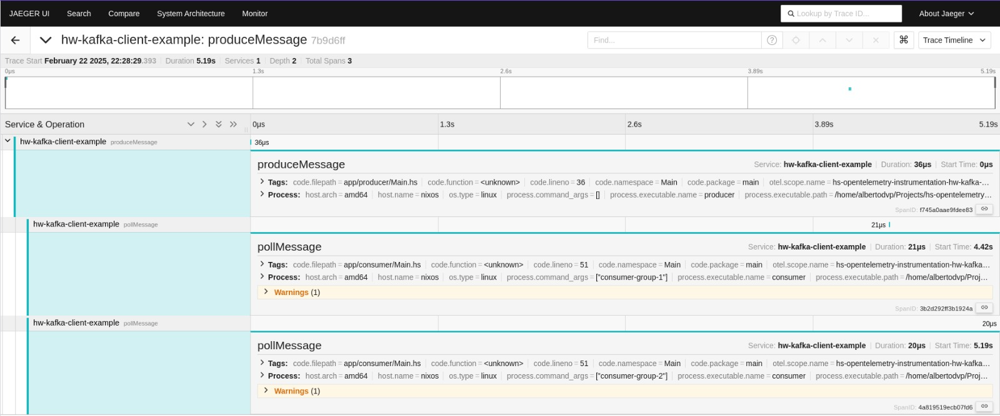

# Kafka Producer and Consumer Example  

This example demonstrates how to integrate **OpenTelemetry** with Kafka (or Redpanda) using a **producer** and multiple **consumers**.  

A **Docker Compose** setup is included to start the required infrastructure, including **Redpanda** (Kafka-compatible event streaming) and **Jaeger** for tracing visualization.  

---

## Infrastructure Setup  

Start the required services:  

```bash
docker compose up
```

### Observability Dashboards:
- **Redpanda Console**: [http://127.0.0.1:8080/overview](http://127.0.0.1:8080/overview)  
- **Jaeger UI**: [http://localhost:16686](http://localhost:16686)  

This setup allows tracing of message flow between the producer and consumers using OpenTelemetry.

---

## Running the Producer  

Set up OpenTelemetry environment variables and start the producer:  

```bash
export OTEL_PROPAGATORS="tracecontext"
export OTEL_SERVICE_NAME="hw-kafka-client-example"
cabal run producer
```

---

## Running Consumers  

Run multiple consumers in separate consumer groups:

```bash
export OTEL_PROPAGATORS="tracecontext"
export OTEL_SERVICE_NAME="hw-kafka-client-example"
cabal run consumer -- consumer-group-1
```

```bash
export OTEL_SERVICE_NAME="hw-kafka-client-example"
cabal run consumer -- consumer-group-2
```

---

Here's the updated README with a section that includes an **example trace visualization in Jaeger**. Since I can't embed an actual image directly here, I'll describe where to add the image and provide a placeholder for it.

---

## Expected Output in Jaeger  

Once everything is running, you should see traces in Jaeger similar to the one below. This represents a message flow from the producer to consumers.  

**Example Trace Visualization:**  



To capture this, open **Jaeger UI** ([http://localhost:16686](http://localhost:16686)), search for traces related to `"hw-kafka-client-example"`, and select a trace to view its spans. You should see:  
- A **producer span** indicating when a message was sent.  
- **Consumer spans** showing message processing.  
- Propagation of the trace context across Kafka messages.  

---

## Redpanda vs. Kafka  

This example uses **Redpanda**, but it is fully compatible with **Apache Kafka** since Redpanda implements the Kafka API.
