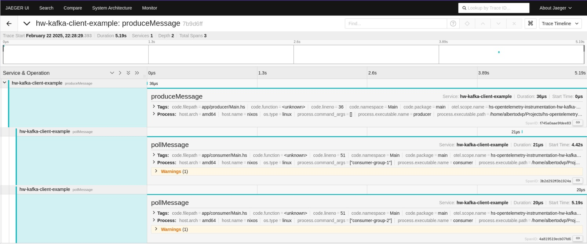

# Kafka Producer and Consumer Example

An example project demonstrating Kafka-compatible[^1] producer & consumer instrumentation with [hs-opentelemetry-instrumentation-hw-kafka-client].

[^1]: This example uses [Redpanda](https://github.com/redpanda-data/redpanda) for simplicity, as [Redpanda is compatible with Apache Kafka versions 0.11 and later](https://docs.redpanda.com/current/develop/kafka-clients/).

- [Usage](#usage)
  - [Infrastructure](#infrastructure)
    - [Observability Dashboards](#observability-dashboards)
  - [Spawn the Producer](#spawn-the-producer)
  - [Spawn Multiple Consumers](#spawn-multiple-consumers)
  - [Expected Output](#expected-output)

## Usage

### Infrastructure

Start the required services:

```bash
docker compose up
```

#### Observability Dashboards:

- Redpanda Console: [http://127.0.0.1:8080/overview](http://127.0.0.1:8080/overview)
- Jaeger UI: [http://localhost:16686](http://localhost:16686)

### Spawn the Producer

Set up OpenTelemetry environment variables and start the producer:

```bash
export OTEL_PROPAGATORS="tracecontext"
export OTEL_SERVICE_NAME="hw-kafka-client-example"
cabal run producer
```

### Spawn Multiple Consumers

Run multiple consumers in separate consumer groups:

```bash
export OTEL_PROPAGATORS="tracecontext"
export OTEL_SERVICE_NAME="hw-kafka-client-example"
cabal run consumer -- consumer-group-1
```

```bash
export OTEL_PROPAGATORS="tracecontext"
export OTEL_SERVICE_NAME="hw-kafka-client-example"
cabal run consumer -- consumer-group-2
```

### Expected Output

Once everything is running you should see examples in the Jaeger dashboard that match the producer -> consumer message flow:


