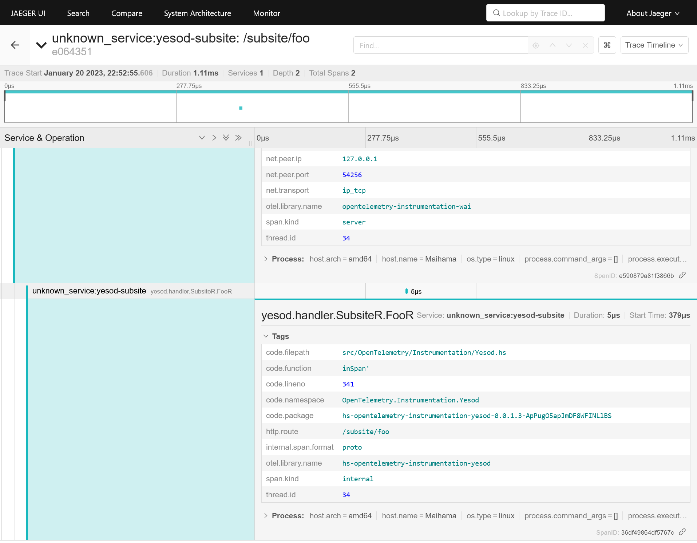

# yesod-subsite Example

This example shows how to use hs-opentelemetry-instrumentation-wai and hs-opentelemetry-instrumentation-yesod with Yesod subsite.

## How to Run

Run a following command to start Jaeger.

```
$ make server.run
```

Build and run this example in another shell.

```
$ make app.run
```

You can access following end points.

- http://localhost:16686/
  - Jaeger UI
- http://localhost:3000/
  - target app

When you access http://localhost:3000/, Open Telemetry's traces are sent to the Jaeger.
And you can see the traces at http://localhost:16686.


